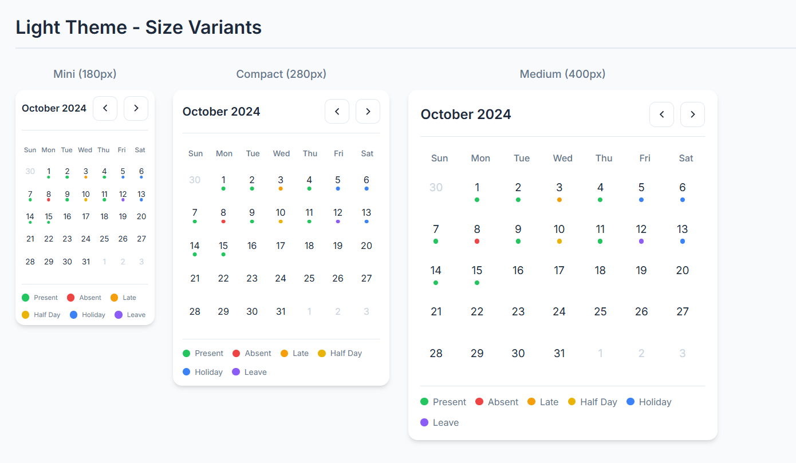
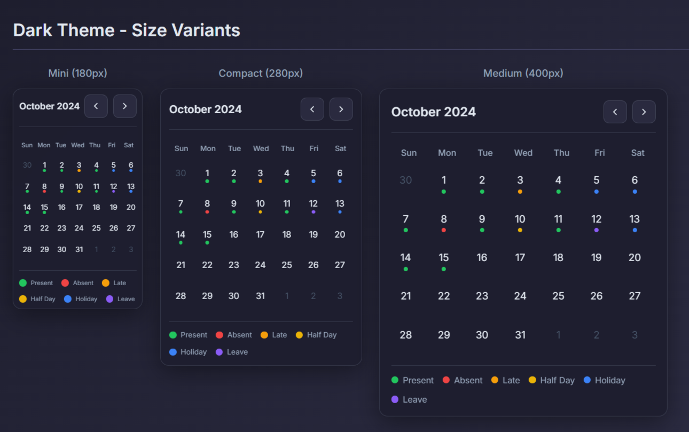
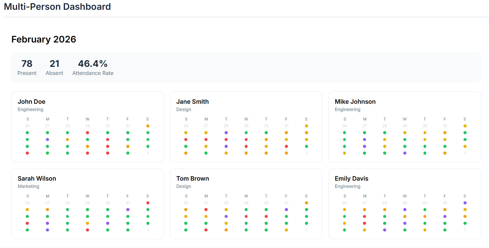
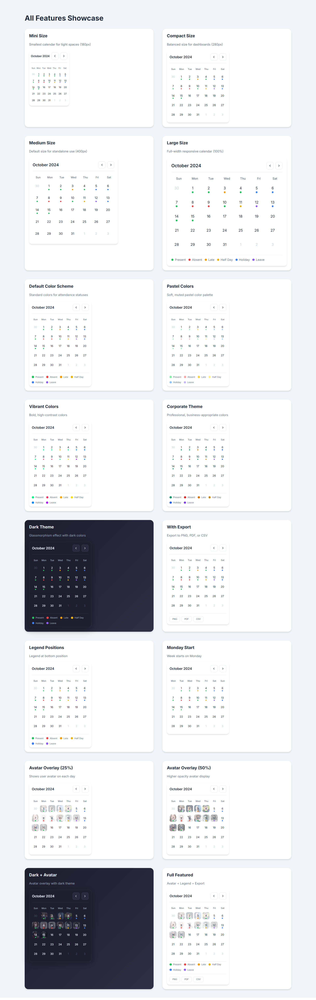

# Django Attendance Calendar

A beautiful, feature-rich Django widget for displaying attendance with visual indicators (dots), multiple themes, color schemes, and export options.

[](https://pypi.org/project/django-attendance-calendar/)
[](https://pypi.org/project/django-attendance-calendar/)
[](https://www.djangoproject.com/)
[](https://www.python.org/)
[](LICENSE)

## Features

- **Multiple Themes**: Light, Dark (with glassmorphism), and Auto (follows system)
- **Color Schemes**: Default, Pastel, Vibrant, Monochrome, Corporate
- **Size Variants**: Mini, Compact, Medium, Large (responsive)
- **Legend Component**: Top, Bottom, Left, or Right positioning
- **Multi-Person Dashboard**: Team attendance view with stats
- **Export Options**: PNG, PDF, CSV
- **Accessible**: Keyboard navigation, ARIA labels, screen reader friendly
- **Localization Ready**: Configurable first day of week
- **Django Admin Integration**: Mixins and inlines included

## Screenshots

|              Light Theme              |             Dark Theme              |                Dashboard                |
| :-----------------------------------: | :---------------------------------: | :-------------------------------------: |
|  |  |  |

<p align="center">
  
  <br><em>All Features Showcase</em>
</p>

## Quick Start

### Installation

```bash
pip install django-attendance-calendar
```

### Configuration

Add to `INSTALLED_APPS`:

```python
INSTALLED_APPS = [
    ...
    'attendance_calendar',
]
```

### Basic Usage

**views.py:**

```python
from django.shortcuts import render

def attendance_view(request):
    attendance_data = {
        "2024-10-01": "present",
        "2024-10-02": "absent",
        "2024-10-03": "late",
        "2024-10-04": "half_day",
        "2024-10-05": "leave",
    }
    return render(request, "my_template.html", {"attendance_data": attendance_data})
```

**my_template.html:**

```html


<!-- Include CSS in head -->
<link rel="stylesheet" href="" />
<link
  rel="stylesheet"
  href=""
/>
<link
  rel="stylesheet"
  href=""
/>

<!-- Calendar widget -->


<!-- Include JS at end of body -->
<script src=""></script>
```

## External Dependencies

This package uses the following external libraries for export functionality:

| Library                                         | Required For | CDN                                                                                           |
| ----------------------------------------------- | ------------ | --------------------------------------------------------------------------------------------- |
| [html2canvas](https://html2canvas.hertzen.com/) | PNG Export   | `<script src="https://html2canvas.hertzen.com/dist/html2canvas.min.js"></script>`             |
| [jsPDF](https://github.com/parallax/jsPDF)      | PDF Export   | `<script src="https://cdnjs.cloudflare.com/ajax/libs/jspdf/2.5.1/jspdf.umd.min.js"></script>` |

**Note**: These libraries are only required if you use `show_export=True`. CSV export works without any external dependencies.

### Complete Export Setup

```html
<!-- Add before closing </body> tag -->
<script src="https://html2canvas.hertzen.com/dist/html2canvas.min.js"></script>
<script src="https://cdnjs.cloudflare.com/ajax/libs/jspdf/2.5.1/jspdf.umd.min.js"></script>
<script src=""></script>
```

## Size Variants

Choose the right size for your layout:

| Size      | Width | Cell Size | Best For                       |
| --------- | ----- | --------- | ------------------------------ |
| `mini`    | 180px | 22px      | Sidebars, compact dashboards   |
| `compact` | 280px | 32px      | Cards, grid layouts            |
| `medium`  | 400px | 40px      | Standalone calendars (default) |
| `large`   | 100%  | 48px      | Full-width, hero sections      |

```django
{# Mini - for sidebars #}


{# Compact - for dashboards #}


{# Medium - default #}


{# Large - full width #}

```

## Template Tags

### ``

Renders a single attendance calendar.

| Parameter         | Type  | Default         | Description                                               |
| ----------------- | ----- | --------------- | --------------------------------------------------------- |
| `data`            | dict  | required        | Date to status mapping                                    |
| `theme`           | str   | `"light"`       | `light`, `dark`, `auto`                                   |
| `color_scheme`    | str   | `"default"`     | `default`, `pastel`, `vibrant`, `monochrome`, `corporate` |
| `size`            | str   | `"medium"`      | `mini`, `compact`, `medium`, `large`                      |
| `year`            | int   | current         | Year to display                                           |
| `month`           | int   | current         | Month to display                                          |
| `show_legend`     | bool  | `False`         | Show status legend                                        |
| `legend_position` | str   | `"bottom"`      | `top`, `bottom`, `left`, `right`                          |
| `show_avatar`     | bool  | `False`         | Show avatar overlay on days                               |
| `avatar_opacity`  | float | `0.25`          | Avatar overlay opacity                                    |
| `show_month_nav`  | bool  | `True`          | Show prev/next navigation                                 |
| `first_day`       | str   | `"sunday"`      | `sunday` or `monday`                                      |
| `highlight_today` | bool  | `True`          | Highlight current date                                    |
| `show_tooltips`   | bool  | `True`          | Show hover tooltips                                       |
| `show_export`     | bool  | `False`         | Show export buttons                                       |
| `export_formats`  | str   | `"png,pdf,csv"` | Comma-separated formats                                   |
| `custom_statuses` | dict  | `None`          | Custom status definitions                                 |
| `css_class`       | str   | `""`            | Additional CSS classes                                    |

### ``

Renders a multi-person dashboard.

| Parameter      | Type | Default     | Description               |
| -------------- | ---- | ----------- | ------------------------- |
| `data`         | dict | required    | Contains `employees` list |
| `theme`        | str  | `"light"`   | `light`, `dark`, `auto`   |
| `color_scheme` | str  | `"default"` | Color scheme to use       |
| `columns`      | int  | `3`         | Calendars per row         |
| `show_summary` | bool | `True`      | Show statistics           |
| `year`         | int  | current     | Year to display           |
| `month`        | int  | current     | Month to display          |
| `first_day`    | str  | `"sunday"`  | Week start day            |

## Data Formats

### Simple Status

```python
attendance_data = {
    "2024-10-01": "present",
    "2024-10-02": "absent",
    "2024-10-03": "late",
}
```

### With Details

```python
attendance_data = {
    "2024-10-01": {"status": "present", "note": "On time"},
    "2024-10-02": {"status": "absent", "note": "Sick leave", "avatar": "/path/to/photo.jpg"},
}
```

### Dashboard Format

```python
dashboard_data = {
    "employees": [
        {
            "id": "1",
            "name": "John Doe",
            "department": "Engineering",
            "attendance": {"2024-10-01": "present", ...}
        },
        ...
    ]
}
```

## Themes

Three theme modes are available:

```django
{# Light theme (default) #}


{# Dark theme with glassmorphism #}


{# Auto - follows system preference #}

```

> **Note**: For dark/auto themes, include `css/themes/dark.css` in addition to light.css.

## Color Schemes

Five built-in color palettes:

| Scheme       | Style                    | Include File             |
| ------------ | ------------------------ | ------------------------ |
| `default`    | Standard balanced colors | `schemes/default.css`    |
| `pastel`     | Soft, muted tones        | `schemes/pastel.css`     |
| `vibrant`    | Bold, high-contrast      | `schemes/vibrant.css`    |
| `corporate`  | Professional, business   | `schemes/corporate.css`  |
| `monochrome` | Grayscale shades         | `schemes/monochrome.css` |

```django


```

## Status Types

| Status     | Default Color  | Description         |
| ---------- | -------------- | ------------------- |
| `present`  | Green #22c55e  | Employee present    |
| `absent`   | Red #ef4444    | Employee absent     |
| `late`     | Amber #f59e0b  | Arrived late        |
| `half_day` | Yellow #eab308 | Half day work       |
| `holiday`  | Blue #3b82f6   | Holiday/non-working |
| `leave`    | Purple #8b5cf6 | Approved leave      |

### Custom Statuses

```python
custom_statuses = {
    "wfh": {"color": "#10b981", "label": "Work From Home"},
    "training": {"color": "#06b6d4", "label": "Training"},
}
```

```django

```

## Django Admin Integration

```python
from attendance_calendar.admin import AttendanceCalendarMixin

@admin.register(Employee)
class EmployeeAdmin(AttendanceCalendarMixin, admin.ModelAdmin):
    attendance_calendar_inline = True
```

## CSS Files Reference

Include the CSS files you need based on your configuration:

| File                         | Purpose                     |
| ---------------------------- | --------------------------- |
| `css/base.css`               | Core styles (required)      |
| `css/themes/light.css`       | Light theme                 |
| `css/themes/dark.css`        | Dark theme + auto detection |
| `css/schemes/default.css`    | Default color scheme        |
| `css/schemes/pastel.css`     | Pastel colors               |
| `css/schemes/vibrant.css`    | Vibrant colors              |
| `css/schemes/corporate.css`  | Corporate colors            |
| `css/schemes/monochrome.css` | Monochrome colors           |

### CSS Customization

Override CSS variables to customize the calendar appearance:

```html
<style>
  .attendance-calendar {
    --cal-dot-gap: 4px; /* Gap between date number and status dot (default: 2px) */
    --cal-dot-size: 8px; /* Status dot size (default: 6px) */
    --cal-cell-size: 44px; /* Day cell size (default: 40px) */
    --cal-gap: 6px; /* Gap between grid cells (default: 4px) */
  }
</style>
```

| Variable              | Default | Description                    |
| --------------------- | ------- | ------------------------------ |
| `--cal-dot-gap`       | `2px`   | Space between date and dot     |
| `--cal-dot-size`      | `6px`   | Status indicator dot diameter  |
| `--cal-cell-size`     | `40px`  | Individual day cell dimensions |
| `--cal-gap`           | `4px`   | Spacing between calendar cells |
| `--cal-padding`       | `16px`  | Calendar container padding     |
| `--cal-border-radius` | `12px`  | Calendar corner radius         |

## Project Structure

```
django-attendance-calendar/
├── attendance_calendar/
│   ├── __init__.py
│   ├── apps.py
│   ├── admin.py
│   ├── templatetags/
│   │   └── attendance_tags.py
│   ├── templates/attendance_calendar/
│   │   ├── calendar.html
│   │   └── dashboard.html
│   └── static/attendance_calendar/
│       ├── css/
│       │   ├── base.css
│       │   ├── themes/
│       │   └── schemes/
│       └── js/
│           └── calendar.js
├── example_project/
├── pyproject.toml
├── LICENSE
└── README.md
```

## Development

### Run Example Project

```bash
# Clone the repository
git clone https://github.com/Rohan7654/django-attendance-calendar.git
cd django-attendance-calendar

cd example_project
python -m venv venv
venv\Scripts\activate
pip install django
python manage.py migrate
python manage.py runserver
```

Visit:

- http://localhost:8000/ - Light theme demo
- http://localhost:8000/dark/ - Dark theme demo
- http://localhost:8000/dashboard/ - Dashboard demo
- http://localhost:8000/all-features/ - All features showcase

## Accessibility

- **Keyboard Navigation**: Use arrow keys to move between days
- **Focus Indicators**: Clear visual focus states on all interactive elements
- **Screen Reader**: ARIA labels and semantic HTML
- **Reduced Motion**: Respects `prefers-reduced-motion` setting

## Browser Support

- Chrome/Edge (latest)
- Firefox (latest)
- Safari (latest)

## License

MIT License - see [LICENSE](LICENSE)

## Contributing

Contributions welcome! Please open an issue or PR.
